# Active Directory Home Lab

## 📌 Overview
This project simulates a real-world IT help desk environment using Active Directory.  
It includes domain setup, user and group management, shared folder permissions, and common troubleshooting scenarios.

---

## 🧱 Lab Environment

- Hypervisor: VirtualBox  
- Windows Server 2019 (Domain Controller)  
- Windows 10 (Client Machine)  

---

## 🌐 Network Configuration

- Domain Controller IP: 192.168.10.10  
- Client IP: 192.168.10.20  
- DNS configured to point to Domain Controller  
- Internal network used for communication  

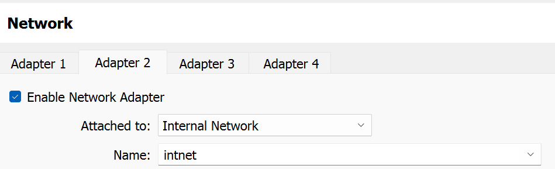

---

## ⚙️ Active Directory Setup

- Installed Active Directory Domain Services (AD DS)  
- Promoted server to Domain Controller  
- Created domain: `homelab.local`  

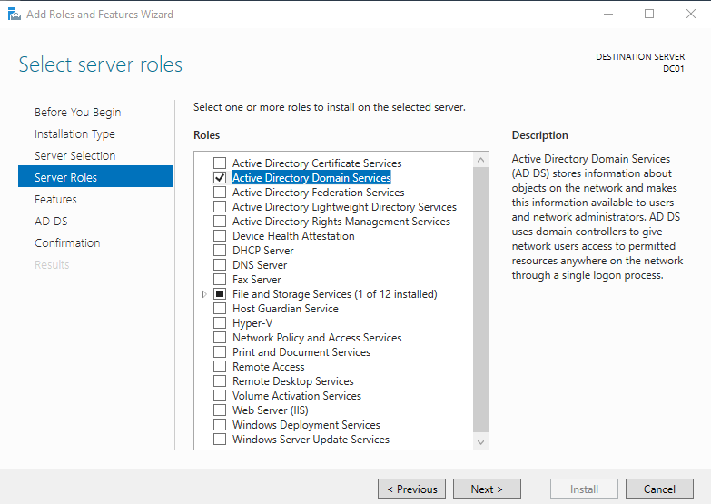  
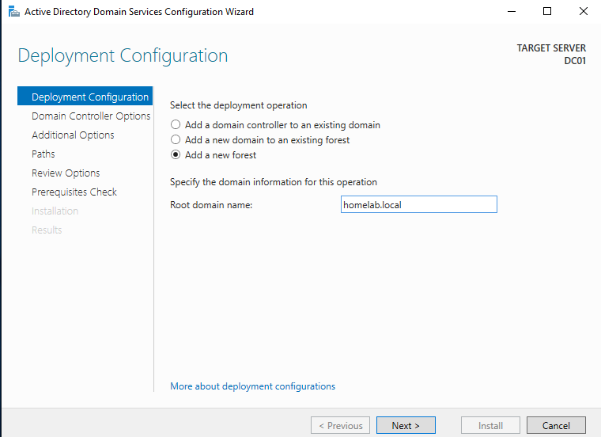

---

## 👥 User & Group Management

- Created Organizational Units:
  - HR, Sales, IT  

- Created users:
  - jsmith (HR)  
  - mlopez (Sales)  
  - itadmin  

- Created security groups:
  - HR-Users  
  - Sales-Users  

- Assigned users to appropriate groups  

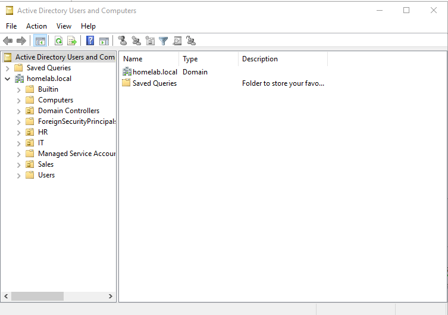  
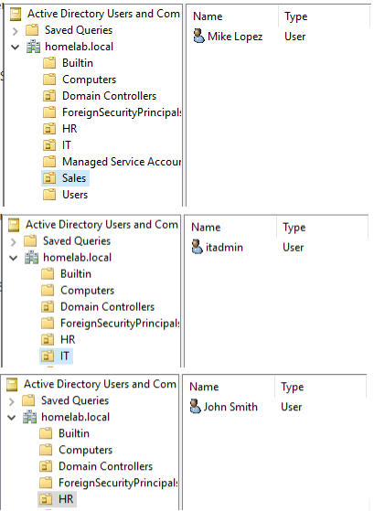  
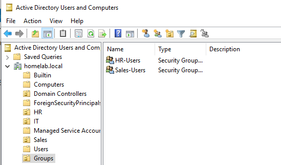

---

## 🖥️ Domain Join

- Joined Windows 10 client to domain  
- Verified login using domain credentials  

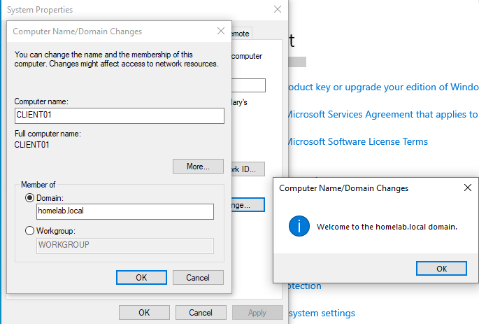  
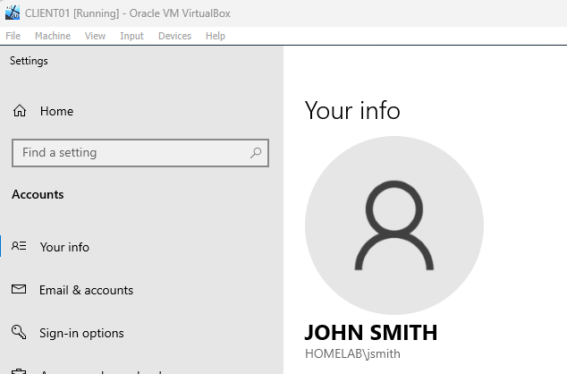

---

## 📁 Shared Folder & Permissions

- Created shared folder: `C:\Departments`  
- Configured subfolders for HR and Sales  
- Assigned permissions using security groups  

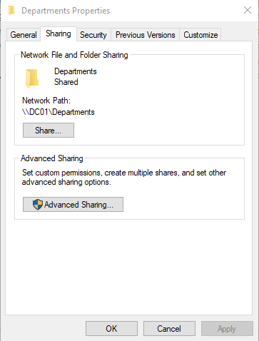  
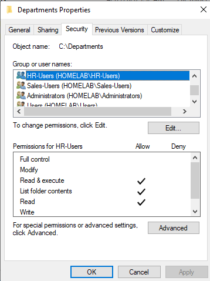  
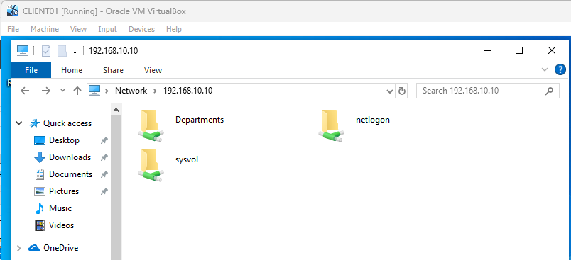

---

## 🛠️ Troubleshooting Scenarios

### 🔹 DNS Misconfiguration (Login Issue)
- Changed client DNS to incorrect server  
- Observed login behavior (cached credentials vs new user)  
- Restored correct DNS to resolve issue  

---

### 🔹 Access Denied (Permissions Issue)
- Removed group permissions  
- Observed continued access due to inherited permissions and default group membership  
- Disabled inheritance and reapplied correct permissions  

---

### 🔹 Account Lockout
- Triggered lockout with multiple failed logins  
- Unlocked account using Active Directory  

---

## 🧠 Key Takeaways

- Gained hands-on experience with Active Directory environments  
- Learned importance of DNS in domain authentication  
- Practiced role-based access control using security groups  
- Troubleshot real-world issues including permission conflicts and account lockouts  

---

## 🔗 Future Improvements

- Implement Group Policy Objects (GPOs)  
- Automate user creation with PowerShell  
- Simulate ticket-based help desk scenarios  
