# Active Directory Home Lab

## 📌 Overview
> Windows Server 2019 Active Directory lab built in VirtualBox to practice domain administration, user management, authentication troubleshooting, and NTFS access control.

---

## 🧱 Lab Environment

- Hypervisor: VirtualBox  
- Windows Server 2019 (Domain Controller)  
- Windows 10 (Client Machine)  

---

## 🌐 Network Configuration

- Domain Controller IP: 192.168.10.10  
- Client IP: 192.168.10.20  
- DNS configured to point to Domain Controller  
- Internal network configured for isolated lab communication

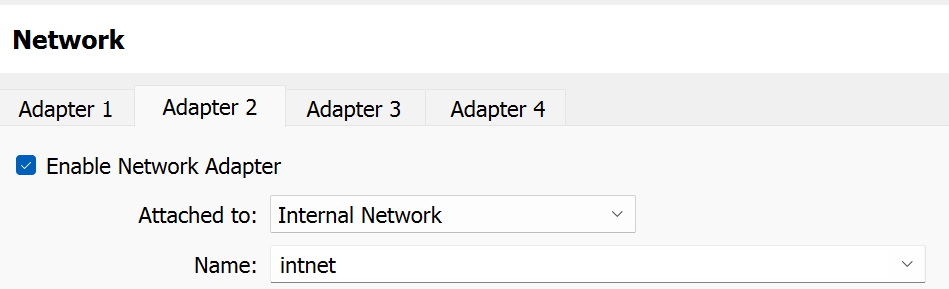

#### Network Flow
Client machine communicates with the Domain Controller for authentication and DNS resolution.

---

## ⚙️ Active Directory Setup

- Installed Active Directory Domain Services (AD DS)  
- Promoted server to Domain Controller  
- Created domain: `homelab.local`  

Configured the server as a Domain Controller to centralize authentication, DNS, and user management for domain-connected clients.

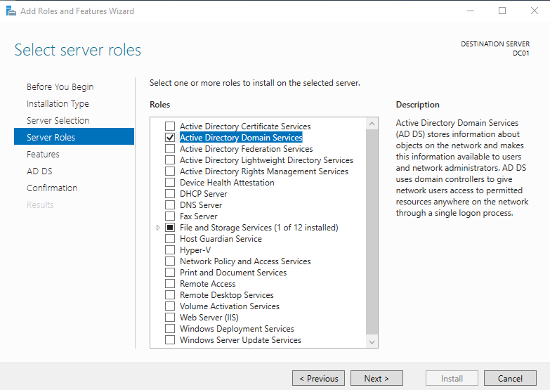  
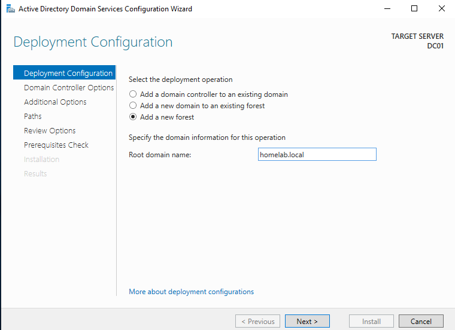

---

## 👥 User & Group Management

- Created Organizational Units:
  - HR, Sales, IT  

- Created users:
  - jsmith (HR)  
  - mlopez (Sales)  
  - itadmin  

- Created security groups:
  - HR-Users  
  - Sales-Users  

- Assigned users to department-based security groups  

Permissions were assigned through security groups rather than directly to user accounts.

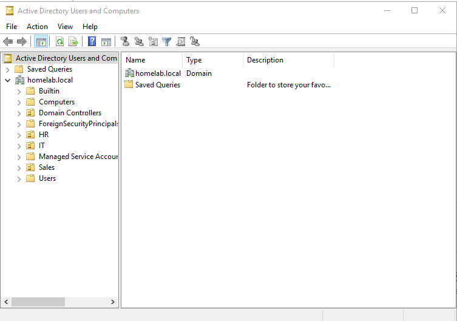  
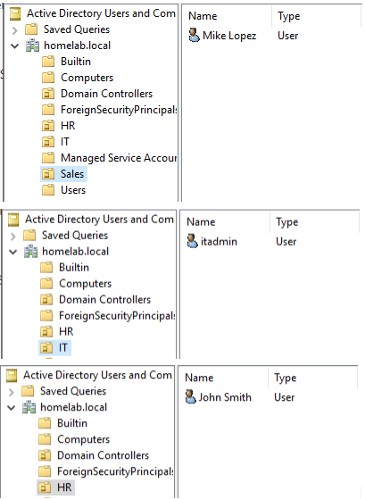  
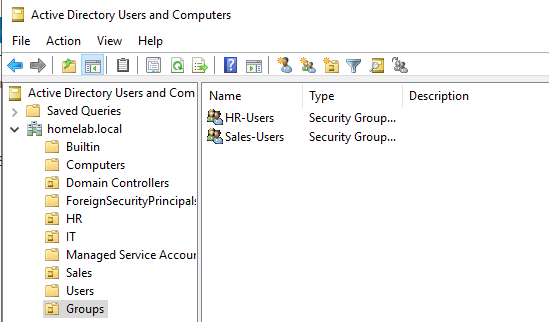

---

## 🖥️ Domain Join

- Joined Windows 10 client to `homelab.local` domain  
- Verified domain authentication by logging in with multiple user accounts

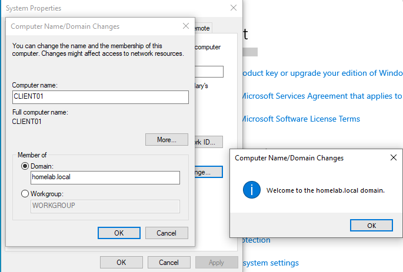  
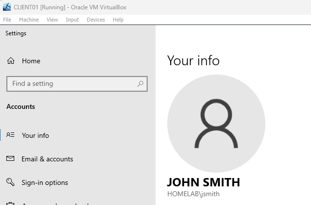

---

## 📁 Shared Folder & Permissions

- Created shared folder: `C:\Departments`  
- Created subfolders:
  - HR  
  - Sales  

- Assigned NTFS permissions using security groups:
  - HR-Users → HR folder  
  - Sales-Users → Sales folder  

- Configured access using least privilege principles
- Tested access from client machine to validate correct permission assignment  

Validated NTFS folder access from the Windows 10 client using department-based security groups. 

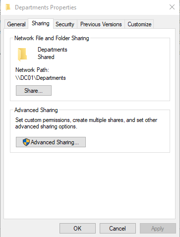  
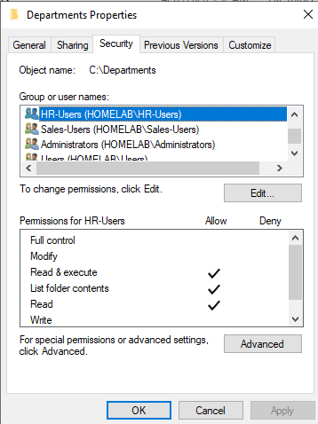  
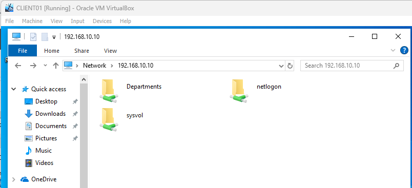

---

## 🛠️ Troubleshooting Scenarios

### 🔹 DNS Misconfiguration (Login Issue)
- **Issue:** Domain login unreliable or unavailable  
- **Cause:** Client DNS pointed to external server instead of domain controller  
- **Observation:** Previously logged-in users could still authenticate due to cached credentials  
- **Resolution:** Updated DNS to Domain Controller (192.168.10.10), restoring authentication  

---

### 🔹 Access Denied (Permissions Issue)
- **Issue:** User retained access after group removal  
- **Cause:** Inherited permissions and default "Domain Users" group access  
- **Resolution:** Disabled inheritance and reapplied permissions using security groups only  

---

### 🔹 Account Lockout
- **Issue:** User unable to log in after multiple failed attempts  
- **Cause:** Account lockout policy triggered  
- **Resolution:** Unlocked account in Active Directory Users and Computers  

---

***These troubleshooting scenarios were used to test authentication, permissions, and client connectivity inside the lab environment.***

---
## 🧠 Key Takeaways

- Built and configured a functional Active Directory environment  
- Understood the role of DNS in domain authentication  
- Implemented role-based access control using security groups  
- Troubleshot real-world issues including:
  - Authentication failures  
  - Permission conflicts  
  - Account lockouts
- Practiced troubleshooting authentication, permissions, and client connectivity issues in a domain environment

---

## 🔗 Future Improvements

- Implement Group Policy Objects (GPOs)  
- Automate user creation using PowerShell  
- Simulate ticket-based help desk scenarios  
- Expand lab with additional clients and services  
